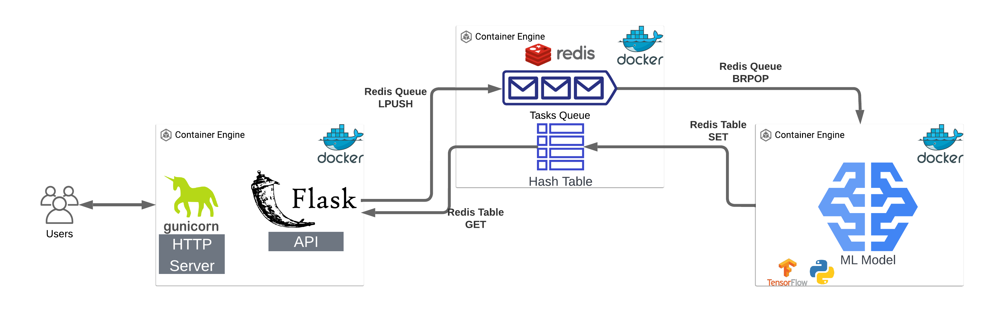

# 🤖 AI Image Classifier - Full Stack Application

> **A beautiful, production-ready AI-powered image classification system built with FastAPI, Next.js, and ResNet50 deep learning model.**



## 🌟 **Project Overview**

This is a complete full-stack AI application that demonstrates modern web development practices combined with machine learning. Users can upload images and get instant AI-powered classifications across 1,000+ categories using a pre-trained ResNet50 model.

### ✨ **Key Features**

- 🧠 **Advanced AI Classification** - ResNet50 model with 1,000+ ImageNet categories
- 🎨 **Beautiful Modern UI** - Next.js 14 with Tailwind CSS and animations
- 🔐 **Secure Authentication** - JWT-based user system
- 📸 **Drag & Drop Upload** - Intuitive image upload experience
- 📊 **Real-time Results** - Instant classification with confidence scores
- 💬 **Feedback System** - Continuous learning from user interactions
- 🐳 **Fully Containerized** - Docker-based microservices architecture
- 🚀 **Production Ready** - Optimized for cloud deployment

## 🏗️ **Architecture**

### **Microservices Design**
```
┌─────────────────┐    ┌──────────────────┐    ┌─────────────────┐
│   Next.js UI   │───▶│   FastAPI Core   │───▶│  ML Service     │
│  (Port 3000)   │    │   (Port 8000)    │    │  (ResNet50)     │
└─────────────────┘    └──────────────────┘    └─────────────────┘
                              │                          │
                              ▼                          ▼
                        ┌──────────────┐        ┌─────────────────┐
                        │ PostgreSQL   │        │     Redis       │
                        │ (Port 5432)  │        │  (Message Queue)│
                        └──────────────┘        └─────────────────┘
```

### **Technology Stack**

| Component | Technology | Purpose |
|-----------|------------|---------|
| **Frontend** | Next.js 14 + TypeScript | Modern React framework with SSR |
| **Backend** | FastAPI + Python | High-performance async API |
| **AI Model** | ResNet50 + TensorFlow | Deep learning image classification |
| **Database** | PostgreSQL | User data and feedback storage |
| **Cache/Queue** | Redis | Async job processing |
| **Styling** | Tailwind CSS + shadcn/ui | Beautiful, responsive design |
| **Deployment** | Docker + Docker Compose | Containerized deployment |

## 🚀 **Quick Start**

### **Prerequisites**
- Docker & Docker Compose
- Node.js 18+ (for frontend development)
- Git

### **1. Clone & Setup**
```bash
git clone <your-repo>
cd assignment
```

### **2. Environment Configuration**
```bash
# Copy environment file
cp .env.original .env.local

# Update with your settings
DATABASE_USERNAME=postgres
DATABASE_PASSWORD=your_password
SECRET_KEY=your_secret_key
```

### **3. Start Services**
```bash
# Start all microservices
docker-compose up --build -d

# Populate database
docker-compose exec api python populate_db.py
```

### **4. Access Applications**
- 🎨 **Frontend (Next.js)**: http://localhost:3000
- 🔧 **API Documentation**: http://localhost:8000/docs
- 🧠 **ML Service**: Internal (Redis queue)
- 📊 **Database**: localhost:5432

### **5. Login Credentials**
```
Email: admin@example.com
Password: admin
```

## 📊 **AI Model Capabilities**

Our ResNet50 model can classify **1,000+ categories** including:

| Category | Examples | Count |
|----------|----------|-------|
| 🐾 **Animals** | Dogs, cats, wild animals, birds, fish, insects | 300+ types |
| 🚗 **Vehicles** | Cars, planes, boats, motorcycles, trucks | 50+ types |
| 🍎 **Food & Drinks** | Fruits, vegetables, dishes, beverages | 100+ types |
| 💻 **Objects** | Electronics, furniture, tools, sports equipment | 200+ types |
| 🌸 **Nature** | Flowers, trees, landscapes, weather phenomena | 150+ types |
| 👕 **Fashion** | Clothing, accessories, footwear | 50+ types |

## 🛠️ **Development**

### **Project Structure**
```
assignment/
├── api/                    # FastAPI backend
│   ├── app/               # Application code
│   ├── tests/             # API tests
│   └── Dockerfile         # API container
├── model/                 # ML service
│   ├── ml_service.py      # ResNet50 inference
│   └── Dockerfile         # ML container
├── nextjs-ui/             # Next.js frontend
│   ├── src/               # React components
│   ├── public/            # Static assets
│   └── Dockerfile         # UI container (optional)
└── docker-compose.yml     # Orchestration
```

### **Available Scripts**

```bash
# Backend Development
cd api
python -m pytest                    # Run tests
docker-compose logs api             # View API logs

# Frontend Development  
cd nextjs-ui
npm run dev                         # Development server
npm run build                       # Production build
npm run start                       # Production server

# Full Stack
docker-compose up --build           # Rebuild all services
docker-compose down                 # Stop all services
```

## 🚀 **Deployment**

### **Local Development**
- All services run via Docker Compose
- Hot reload enabled for development
- PostgreSQL data persisted in `db_data/`

### **Production Deployment**
- **Frontend**: Deploy to Vercel/Netlify
- **Backend**: Deploy to Heroku/Railway/DigitalOcean
- **Database**: Use managed PostgreSQL (AWS RDS, etc.)
- **Redis**: Use managed Redis (Redis Cloud, etc.)

## 📈 **Performance & Scalability**

- ⚡ **Sub-second predictions** with ResNet50 optimization
- 🔄 **Async processing** with Redis job queue
- 📦 **Microservices** for independent scaling
- 🗂️ **Efficient caching** with Redis
- 📊 **Optimized bundle** (~142KB frontend)

## 🧪 **Testing**

```bash
# API Tests
cd api && python -m pytest -v

# Integration Tests
cd tests && python -m pytest test_integration.py

# Load Testing
cd stress_test && locust -f locustfile.py
```

## 📝 **API Documentation**

Complete API documentation available at: **http://localhost:8000/docs**

### **Key Endpoints**
- `POST /login` - User authentication
- `POST /user/` - User registration  
- `POST /model/predict` - Image classification
- `POST /feedback/` - Submit feedback
- `GET /feedback/` - Retrieve feedback

## 🤝 **Contributing**

1. Fork the repository
2. Create a feature branch (`git checkout -b feature/amazing-feature`)
3. Commit changes (`git commit -m 'Add amazing feature'`)
4. Push to branch (`git push origin feature/amazing-feature`)
5. Open a Pull Request

## 📄 **License**

This project is licensed under the MIT License - see the [LICENSE](LICENSE) file for details.

## 👨‍💻 **About**

Built as a comprehensive demonstration of modern full-stack development with AI integration. Perfect for learning microservices architecture, machine learning deployment, and production-ready web applications.

---

**🎊 Built with ❤️ using FastAPI, Next.js, ResNet50, and modern DevOps practices**
